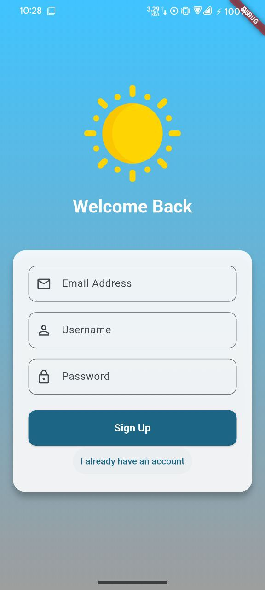
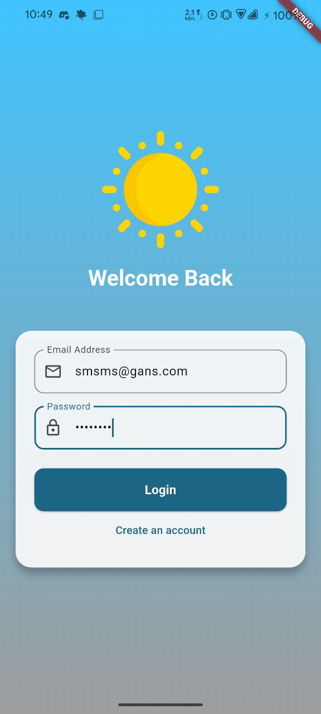
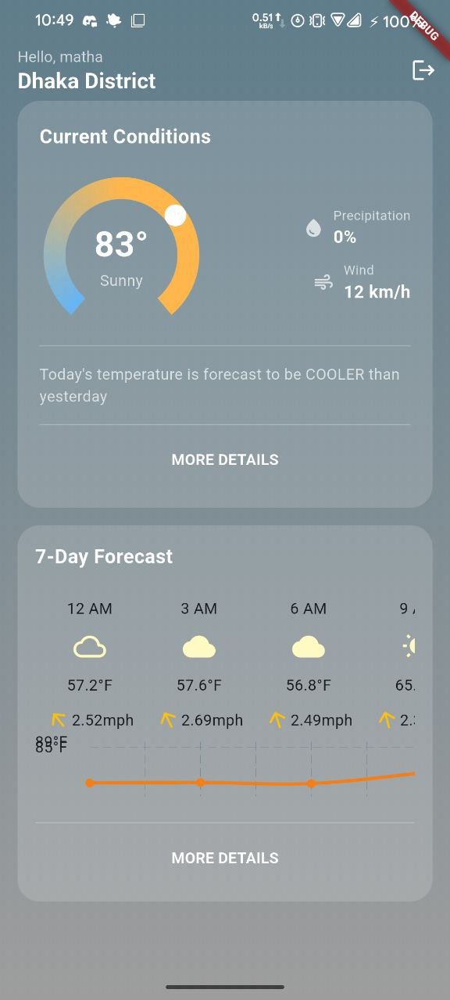

# Weather App 🌤️

A modern, beautiful weather application built with Flutter. This app provides real-time weather updates and a 7-day forecast with a stunning, glassmorphic UI.

## Features ✨

- **Real-time Weather Data**: Get current temperature, precipitation, and wind details.
- **7-Day Forecast**: Plan your week with a scrollable daily forecast.
- **Interactive Graphs**: Visual temperature trends using Syncfusion Gauges and Charts.
- **User Authentication**: Secure login and signup powered by Firebase Auth.
- **Modern UI**: Featuring glassmorphism, dynamic gradients, and smooth animations.

## Screenshots 📱

| Statistics | Forecast | Home |
|:---:|:---:|:---:|
|  |  |  |

## Tech Stack 🛠️

- **Framework**: [Flutter](https://flutter.dev/)
- **State Management**: [Bloc / Cubit](https://bloclibrary.dev/)
- **Backend**: [Firebase](https://firebase.google.com/) (Auth, Firestore)
- **UI Components**: [Syncfusion Flutter Gauges](https://pub.dev/packages/syncfusion_flutter_gauges)

## Getting Started 🚀

1.  **Clone the repository**:
    ```bash
    git clone https://github.com/yourusername/weather-app.git
    ```
2.  **Install dependencies**:
    ```bash
    flutter pub get
    ```
3.  **Run the app**:
    ```bash
    flutter run
    ```

> Note: Ensure you have your `google-services.json` configured for Firebase to work correctly.
